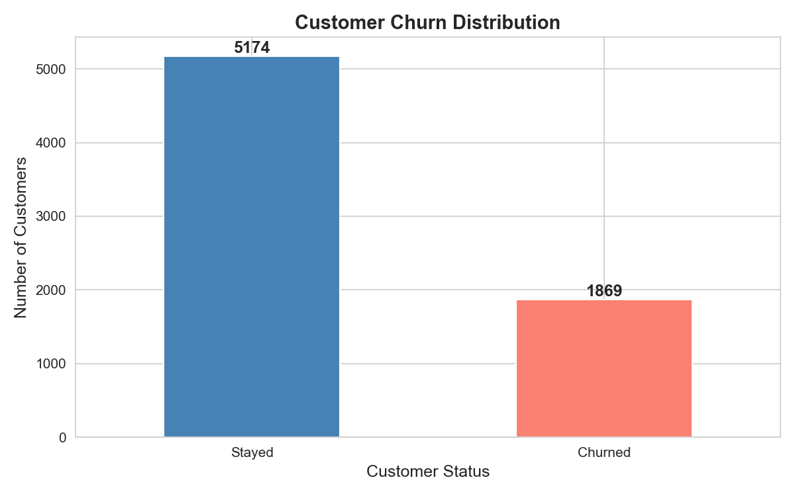
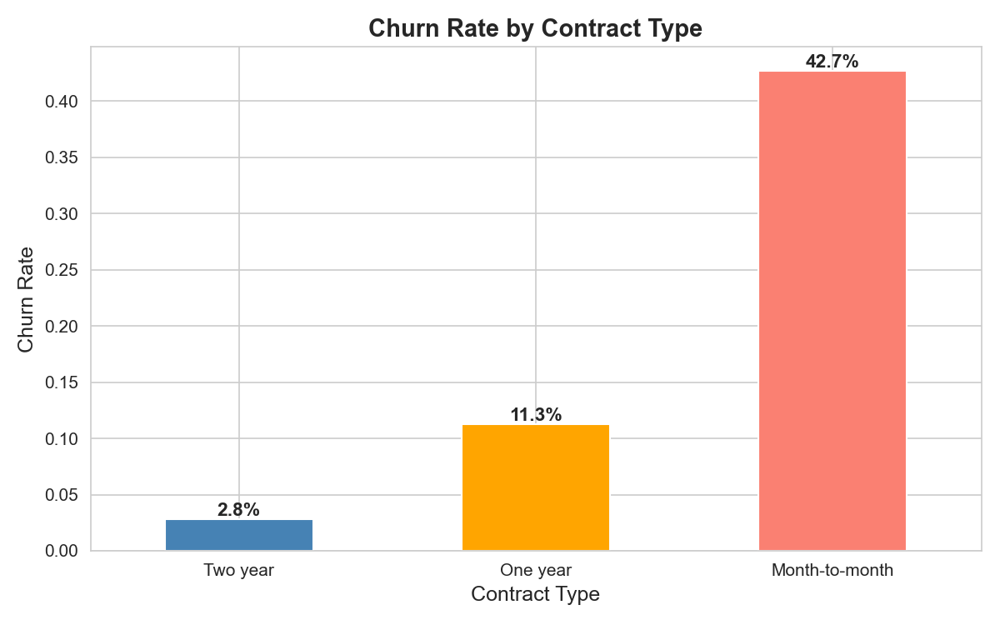
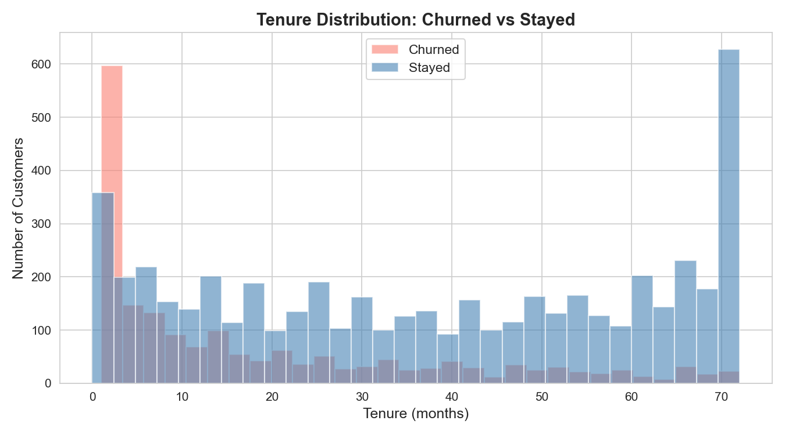

# Customer Churn Analysis

> Predicting which telecom customers are likely to churn using machine learning — from raw data exploration to deployed interactive dashboard.


---

## Overview

This project analyses a telecom company's customer dataset to understand
and predict customer churn. Using Python, Pandas, Matplotlib, and machine
learning, I identified the key drivers of churn and built a predictive
model that flags at-risk customers before they leave.

**Key finding:** 26.5% of customers are churning — nearly double the
telecom industry average of 10-15%. Month-to-month contract customers
churn at 42.7%, and the highest risk window is within the first 12 months
of tenure.

---

## Objectives

- Understand the overall churn rate and its business significance
- Identify which factors most strongly predict customer churn
- Build a machine learning model to predict individual churn probability
- Deliver actionable retention strategy recommendations
- Deploy findings as an interactive dashboard

---

## Dataset

| Detail          | Value                             |
| --------------- | --------------------------------- |
| Source          | IBM Telco Customer Churn (Kaggle) |
| Rows            | 7,043 customers                   |
| Columns         | 21 features                       |
| Target variable | Churn (Yes/No)                    |
| Missing values  | 11 (all new customers — handled)  |

---

## Tech Stack

| Tool         | Purpose                          |
| ------------ | -------------------------------- |
| Python 3.x   | Core programming language        |
| Pandas       | Data manipulation and cleaning   |
| NumPy        | Numerical operations             |
| Matplotlib   | Data visualisation               |
| Seaborn      | Statistical visualisation        |
| Scikit-learn | Machine learning models          |
| XGBoost      | Advanced gradient boosting model |
| Streamlit    | Interactive dashboard deployment |

---

## Key Findings

### Finding 1 — High Churn Rate Identified



- **5,174 customers retained** (73.5%)
- **1,869 customers churned** (26.5%)
- Churn rate is nearly **double** the telecom industry average of 10-15%
- This represents a significant and measurable revenue risk

---

### Finding 2 — Contract Type is the Strongest Predictor



| Contract Type  | Churn Rate |
| -------------- | ---------- |
| Two year       | Lowest     |
| One year       | Medium     |
| Month-to-month | **42.7%**  |

Almost 1 in 2 month-to-month customers churns. Customers on longer
contracts show dramatically better retention. Converting month-to-month
customers to annual contracts is the single highest-impact retention action.

---

### Finding 3 — First 12 Months is the Critical Danger Window



- Churned customers are heavily concentrated in **months 1-12**
- Peak churn occurs in the **first few months** of tenure
- Customers who survive beyond **24 months** rarely churn
- Early intervention programmes targeting new customers could
  significantly reduce this early churn spike

---

## Project Structure

    customer-churn-analysis/
    ├── data/
    │   ├── WA_Fn-UseC_-Telco-Customer-Churn.csv
    │   └── churn_cleaned.csv
    ├── notebooks/
    │   ├── 01_first_look.ipynb
    │   ├── 02_data_cleaning.ipynb
    │   └── 03_visualisation.ipynb
    ├── reports/
    │   ├── churn_distribution.png
    │   ├── churn_by_contract.png
    │   └── tenure_vs_churn.png
    ├── requirements.txt
    └── README.md

---

## Installation & Usage

```bash
# Clone the repository
git clone https://github.com/John-Ayomide/customer-churn-analysis

# Navigate into the project
cd customer-churn-analysis

# Create and activate virtual environment
python -m venv venv
venv\Scripts\activate        # Windows
source venv/bin/activate     # Mac/Linux

# Install dependencies
pip install -r requirements.txt

# Launch Jupyter Notebook
jupyter notebook
```

---

## Notebooks Guide

| Notebook                 | Description                                             |
| ------------------------ | ------------------------------------------------------- |
| `01_first_look.ipynb`    | Load data, check structure, calculate churn rate        |
| `02_data_cleaning.ipynb` | Fix data types, handle missing values, encode columns   |
| `03_visualisation.ipynb` | Build charts, identify churn drivers, document findings |

---

## Business Recommendations

Based on the analysis so far:

1. **Target month-to-month customers** — offer incentives to switch to
   annual contracts. This single action addresses the highest churn segment.

2. **Launch an early tenure programme** — customers in months 1-12 are
   at highest risk. Dedicated onboarding, loyalty rewards, and check-in
   calls during this window could significantly reduce early churn.

3. **Build a predictive model** — use the identified features to flag
   at-risk customers before they leave, enabling proactive retention.

---

## Roadmap

- [x] Data exploration and EDA
- [x] Data cleaning pipeline
- [x] Visualisation and insight generation
- [ ] Machine learning model (Random Forest + XGBoost)
- [ ] SHAP feature importance analysis
- [ ] Streamlit interactive dashboard
- [ ] Executive summary report

---

## Author

**John Ayomide**

- GitHub: [@John-Ayomide](https://github.com/John-Ayomide)
- LinkedIn: [Your LinkedIn Profile](https://https://www.linkedin.com/in/john-aiyenomuro-19aa26211/?lipi=urn%3Ali%3Apage%3Ad_flagship3_profile_view_base_contact_details%3B%2FxxupC3sQQOhte8VhfIWtg%3D%3D)
- Email: jayomide123@gmail.com
